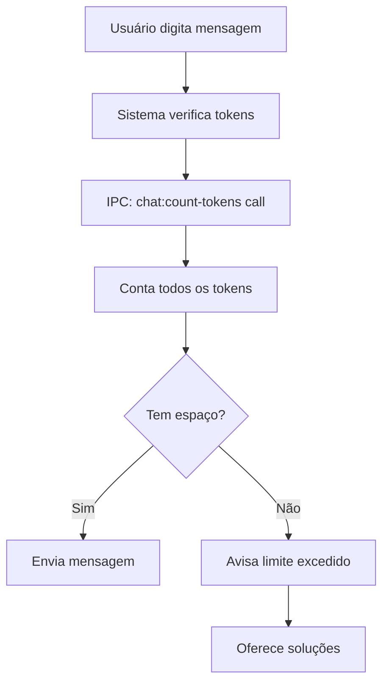

# Explicação: Por que `chat:count-tokens` com `input:""` está Correto?

## 🎯 **O Que Essa Chamada Faz**

A mensagem que você viu:
```
IPC: chat:count-tokens called with args: [{"chatId":1,"input":""}]
```

É uma **verificação de tokens** - não uma nova mensagem sendo enviada!

## 🔍 **Como Funciona o Token Counting**

### **1. O Que é Contado:**
```typescript
// No código token_count_handlers.ts, linha 137-142:
const totalTokens =
  messageHistoryTokens +      // + Histórico do chat (todas as mensagens)
  inputTokens +               // + Input atual (se houver)
  systemPromptTokens +        // + System prompt
  codebaseTokens +            // + Contexto da base de código
  mentionedAppsTokens;        // + Apps mencionados
```

### **2. Por Que Input Vazio?**

Se `input:""`, então `inputTokens = 0`, mas **o resto ainda é contado**:

```typescript
// Linha 56 do handler:
const inputTokens = estimateTokens(req.input); // Se input="", então inputTokens=0

// Mas ainda calcula:
const messageHistoryTokens = estimateTokens(messageHistory); // ✅ Conta histórico
const systemPromptTokens = estimateTokens(systemPrompt);     // ✅ Conta system prompt  
const codebaseTokens = estimateTokens(codebaseInfo);         // ✅ Conta codebase
```

## 📊 **Exemplo Prático**

### **Cenário:**
- Chat ID: 1
- Input: `""` (vazio)
- Histórico: 5 mensagens
- Contexto: 3 arquivos da base de código

### **Resultado:**
```
📊 Análise de Tokens para Chat ID: 1
┌─────────────────────────────────────┐
│ 💬 Histório de mensagens: 1,200     │
│ 📝 Input atual: 0 (vazio)           │  ← Por isso input:""
│ 🤖 System prompt: 800               │
│ 📁 Contexto da base: 3,500          │
│ 🔗 Apps mencionados: 0              │
├─────────────────────────────────────┤
│ 📊 Total: 5,500 tokens              │
│ 🎯 Limite do modelo: 8,192          │
│ ✅ Pode enviar mensagem             │
└─────────────────────────────────────┘
```

## 🎮 **Quando É Usado**

### **1. Antes de Enviar Mensagem:**
```
Usuário: [digita nova mensagem]
Sistema: "Deixa eu verificar se tem espaço na janela de contexto..."
         ↓
         IPC: chat:count-tokens({chatId:1, input:""})
         ↓
         Resultado: "5,500/8,192 tokens - OK para enviar!"
         ↓
         ✅ Envia a nova mensagem
```

### **2. Verificação Manual:**
- Usuário quer saber quantos tokens está usando
- Sistema mostra breakdown detalhado
- Usuário decide se quer enviar ou não

### **3. Otimização Automática:**
- Sistema pode sugerir remover mensagens antigas
- Alerta quando se aproxima do limite
- Oferece resumos para economizar tokens

## 🔄 **Fluxo Completo**



## 🛠️ **Exemplo de Uso no Código**

### **Frontend (React/TS):**
```typescript
// Quando usuário vai enviar mensagem
const countTokens = async () => {
  const result = await ipcRenderer.invoke('chat:count-tokens', {
    chatId: currentChatId,
    input: "" // Vazio = apenas verificar contexto
  });
  
  console.log(`Usando ${result.totalTokens}/${result.contextWindow} tokens`);
  
  if (result.totalTokens > result.contextWindow * 0.9) {
    alert("⚠️ Context window quase cheia! Considere limpar histórico.");
  }
};
```

### **Backend (Handler):**
```typescript
// token_count_handlers.ts - linha 56
const inputTokens = estimateTokens(req.input);

// Se req.input = "", então inputTokens = 0
// Mas TODOS os outros tokens são contados!
```

## ✅ **Por Que Está Correto**

### **1. Funcionalidade Normal:**
- É assim que o sistema **sempre funcionou**
- Input vazio é **intencional** para verificação
- **Não é bug** - é feature!

### **2. Performance:**
- Mais eficiente que contar com input + contexto
- Sistema separa verificação de envio

### **3. UX Melhor:**
- Usuário vê breakdown completo
- Decide se quer enviar baseado nos dados
- Controle total sobre tokens

## 🎯 **Resumo**

- ✅ `chat:count-tokens` com `input:""` está **CORRETO**
- 📊 Conta **todo o contexto** (histórico + system prompt + codebase)
- 🎯 Verifica se há **espaço** para nova mensagem
- 🔄 É **chamado automaticamente** antes de enviar
- 📝 Input vazio significa **"só verificar, não enviar"**

É uma funcionalidade **muito útil** para otimizar o uso de tokens! 🚀