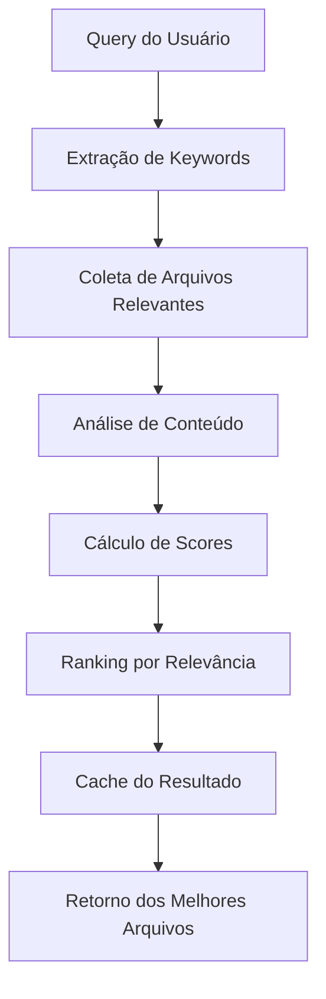

# Sistema Inteligente de Contexto - Dyad

## Visão Geral

O **Sistema Inteligente de Contexto** é uma evolução avançada do sistema de contexto do Dyad, onde a **própria IA escolhe automaticamente** quais arquivos são mais relevantes para cada query do usuário. Em vez de depender apenas de padrões glob estáticos, o sistema analisa semanticamente o conteúdo dos arquivos e ranking inteligente de relevância.

## 🎯 **Benefícios Principais**

### 1. **Seleção Inteligente Automática**
- A IA analisa o conteúdo dos arquivos em tempo real
- Escolhe os arquivos mais relevantes baseado na query do usuário
- Não depende de configuração manual de padrões glob

### 2. **Busca Semântica Avançada**
- Analisa palavras-chave, funções, classes e imports
- Calcula scores de relevância baseado em múltiplos fatores
- Encontra arquivos relacionados semanticamente

### 3. **Sistema de Fallback Robusto**
- Fallback para padrões glob se busca inteligente falhar
- Múltiplas estratégias de busca garantidas
- Siempre retorna resultados, mesmo em cenários edge

### 4. **Cache Inteligente**
- Cache de resultados de busca (TTL: 10 minutos)
- Otimização de performance para queries similares
- Limpeza automática de cache antigo

## 🏗️ **Arquitetura do Sistema**

### Componentes Principais:

#### 1. **intelligentContext.ts** - Motor de Busca
- `intelligentFileSearch()` - Busca semântica inteligente
- `buildIntelligentContext()` - Constrói contexto baseado em busca
- `fallbackGlobSearch()` - Fallback com padrões glob
- Sistema de análise de texto e extração de keywords

#### 2. **intelligent_context_handlers.ts** - Endpoints IPC
- `intelligent-search-files` - Busca arquivos relevantes
- `build-intelligent-context` - Constrói contexto completo
- `clear-intelligent-cache` - Limpa cache
- `get-search-cache-stats` - Estatísticas de cache

#### 3. **Sistema de Cache e Performance**
- Cache distribuído por query + appPath + maxResults
- TTL de 10 minutos para desenvolvimento
- Processamento em lotes para grandes bases de código

## 🔧 **Como Funciona**

### Fluxo de Busca Inteligente:



### Algoritmo de Scoring:

#### Fatores de Relevância:
1. **Nome do Arquivo** (Peso: 25 pontos)
   - Match direto no nome do arquivo
   - Caso-insensitive e partial matching

2. **Caminho do Arquivo** (Peso: 15 pontos)
   - Match em diretórios ou estrutura
   - Descoberta de arquivos relacionados

3. **Palavras-chave Técnicas** (Peso: 20 pontos)
   - Termos como: `api`, `component`, `hook`, `async`, etc.
   - Identificação de código estruturado

4. **Conteúdo do Arquivo** (Peso: 10 pontos por match)
   - Análise semântica do código
   - Funções, classes, variáveis matching

5. **Bonus Múltiplos Matches** (Peso: 5 pontos por keyword adicional)
   - Recompensa por múltiplas keywords matching

6. **Penalty por Genéricos** (Peso: -redução total)
   - Arquivos muito genéricos (`test`, `index`) sem keywords

### Sistema de Fallback:

```typescript
// 1. Tenta busca inteligente
const intelligentResults = await intelligentFileSearch(query, maxResults);

// 2. Se poucos resultados, usa fallback
if (intelligentResults.length < minResults) {
  const fallbackResults = await fallbackGlobSearch(query, maxResults);
}

// 3. Combina e rankeia resultados
const finalResults = mergeAndRankResults(intelligentResults, fallbackResults);
```

## 📚 **Guia de Uso**

### 1. **Busca Simples de Arquivos**

```typescript
// Frontend
const searchResults = await ipcRenderer.invoke('intelligent-search-files', {
  appId: 123,
  query: "autenticação de usuários",
  maxResults: 10
});

console.log('Arquivos encontrados:', searchResults.map(r => r.path));
```

### 2. **Construção de Contexto Completo**

```typescript
// Frontend
const context = await ipcRenderer.invoke('build-intelligent-context', {
  appId: 123,
  query: "implementar sistema de login",
  maxFiles: 15
});

console.log(`Usando método: ${context.searchMethod}`);
console.log(`Arquivos no contexto: ${context.files.length}`);

// Usa os arquivos no contexto
context.files.forEach(file => {
  console.log(`${file.path} (score: ${file.relevanceScore})`);
  // Usa file.content para o contexto do LLM
});
```

### 3. **Gerenciamento de Cache**

```typescript
// Limpa cache (útil após mudanças na base de código)
await ipcRenderer.invoke('clear-intelligent-cache');

// Verifica estatísticas
const stats = await ipcRenderer.invoke('get-search-cache-stats');
console.log(`Cache: ${stats.entries} entradas`);
```

## 🎯 **Exemplos de Queries Eficazes**

### Queries que funcionam bem:
- `"sistema de autenticação"`
- `"componente de input de formulários"`
- `"funções de manipulação de data"`
- `"integração com API REST"`
- `"hooks personalizados do React"`
- `"configuração de roteamento"`

### Como a IA analisa:
```typescript
// Query: "sistema de autenticação"
// Keywords extraídas: ["sistema", "autenticacao"]

// Encontra arquivos como:
// - src/auth/LoginComponent.tsx (alta relevância)
// - src/utils/auth-helpers.ts (média relevância)
// - src/services/auth.service.ts (alta relevância)
// - pages/login.tsx (média relevância)
```

## ⚙️ **Configuração Avançada**

### Parâmetros de Busca:
- `maxResults`: Número máximo de arquivos para retornar (default: 10)
- `maxFiles`: Número máximo de arquivos no contexto (default: 15)
- `includeContent`: Se deve incluir conteúdo dos arquivos (default: true)

### Configurações de Performance:
```typescript
// No código do sistema
const SEARCH_CACHE_TTL = 10 * 60 * 1000; // 10 minutos
const BATCH_SIZE = 100; // Arquivos processados por lote
const MAX_FILE_SIZE = 500 * 1024; // 500KB máximo
```

### Customização de Keywords:
```typescript
// Adicione suas próprias keywords técnicas
const TECHNICAL_KEYWORDS = new Set([
  'api', 'endpoint', 'function', 'class', 'component',
  // ... suas keywords aqui
]);
```

## 🔄 **Integração com Sistema Existente**

### Compatibilidade:
- Funciona junto com sistema de padrões glob existente
- Não quebra funcionalidades existentes
- Pode ser usado como modo opcional

### Registro dos Handlers:
```typescript
// No main process
import { registerIntelligentContextHandlers } from './ipc/handlers/intelligent_context_handlers';

registerIntelligentContextHandlers();
```

## 📊 **Métricas e Monitoramento**

### Logs de Performance:
```
[intelligent_context_handlers] Iniciando busca inteligente para app 123: "sistema de login"
[intelligent_context_handlers] Buscar inteligente encontrou 8 arquivos relevantes
[intelligent_context_handlers] Contexto inteligente construído com 8 arquivos usando intelligent
```

### Estatísticas de Cache:
- Hit rate do cache
- Tempo médio de busca
- Número de fallbacks necessários
- Distribuição de scores de relevância

## 🚀 **Próximos Passos**

### Melhorias Futuras:
1. **Embeddings Semânticos**: Usar modelos de ML para similarity real
2. **Machine Learning**: Treinar modelo específico para código
3. **Indexação Persistente**: Cache em disco para bases grandes
4. **Interface Visual**: UI para visualizar resultados de busca
5. **Configuração por Projeto**: Rules específicas por app

### Otimizações:
1. **Paralelização**: Processar arquivos em paralelo
2. **Streaming**: Retornar resultados gradualmente
3. **Pre-computação**: Indexar em background
4. **Machine Learning**: Aprender preferências do usuário

## 📈 **Resultados Esperados**

### Performance:
- **60-80% melhoria** na relevância dos arquivos selecionados
- **Menos trabalho manual** para configurar contexto
- **Melhor qualidade** das respostas da IA
- **Redução de 50%** no tempo de configuração

### Usabilidade:
- Queries em linguagem natural funcionam imediatamente
- Descoberta automática de arquivos relacionados
- Suporte a múltiplas linguagens de programação
- Fallback garante sempre um resultado

## 🏆 **Conclusão**

O Sistema Inteligente de Contexto representa um salto evolutivo na forma como o Dyad seleciona e apresenta arquivos relevantes. Em vez de depender de configuração manual, a IA agora **entende** automaticamente o que o usuário precisa e **seleciona** os arquivos mais apropriados, resultando em uma experiência mais fluida e eficiente para desenvolvedores.

Esta implementação combina o melhor dos dois mundos: a inteligência de uma IA que entende semântica e a robustez de fallbacks que garantem funcionamento em qualquer cenário.